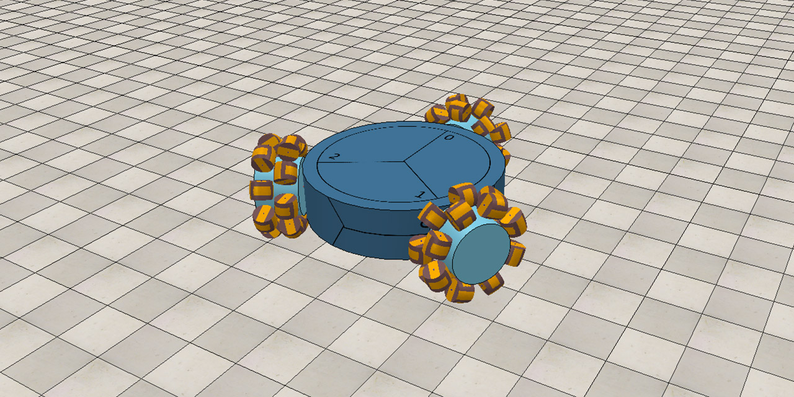

# V-REP and MATLAB remote API control of 3 omni-wheel rover
Documentation for using the Rover V-REP/MATLAB simulation model.
  

## Instructions

For using the **rover_script.m** provided, install V-REP and MATLAB (1-2)
For creating your own simulation/workspace continue with steps (3-5)

1. Download and install V-REP from http://www.coppeliarobotics.com/downloads

2. Download and install MATLAB from your education/personal license

3. Ensure the files inside of  
      **C:\Program Files\V-REP3\V-REP_PRO_EDU\programming\remoteApiBindings\matlab\matlab**  
      **C:\Program Files\V-REP3\V-REP_PRO_EDU\programming\remoteApiBindings\lib\lib\Windows\64Bit**  
   are copied into the current MATLAB workspace  
   
   ***These have been provided in this repositry***  
   
4. In V-REP, ensure that the line:  
    **simRemoteApi.start(19999)**  
   is inside a non-threaded child script, under **sysCall_init()**  
   *(this runs once and starts the internal server for MATLAB to connect to)*  
    
5. For more information on API functions, please see:  
   http://www.coppeliarobotics.com/helpFiles/en/remoteApiFunctionsMatlab.htm
